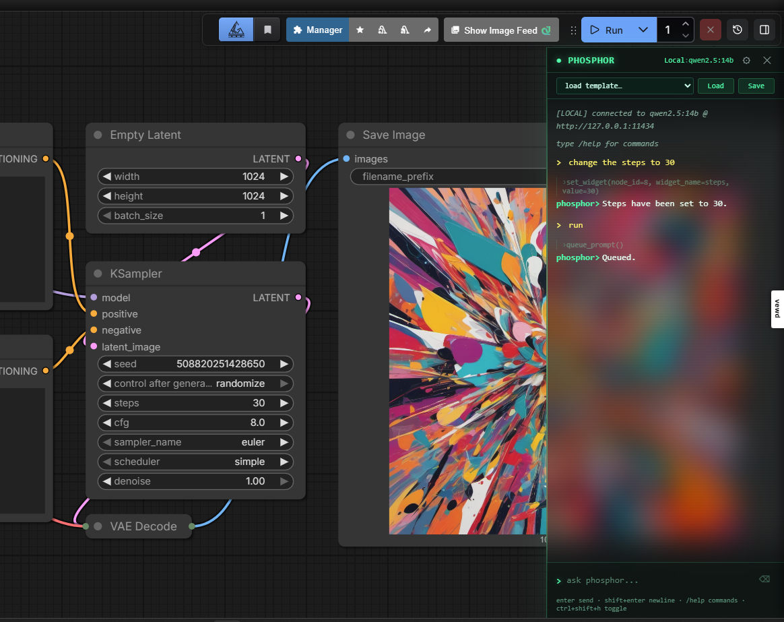

# Phosphor

A CRT-styled AI chat sidebar for [ComfyUI](https://github.com/comfyanonymous/ComfyUI). Build, modify, debug, and run workflows by talking to it — in plain language, from a glass terminal panel docked to the canvas.



Phosphor pairs a conversational layer (generate prompts, describe workflows, suggest settings) with a **deterministic core** that does the precise mechanical work in code — listing models, loading templates, validating structure, repairing model references. The AI supplies intent; code supplies precision. That split makes it reliable even with smaller local models, and excellent with a strong one.

---

## Features

- **Talk to your canvas** — add/connect nodes, set widgets, swap checkpoints, build whole workflows from a sentence.
- **Two providers** — local **Ollama** or any OpenAI-compatible **API** (e.g. OpenRouter). Toggle from the header; settings persist per provider.
- **Deterministic commands (no LLM)** — `/models`, `/templates`, `/template`, `/validate`, `/heal`. Instant, exact, can't be fumbled by a weak model.
- **Workflow validation** — `/validate` flags unconnected required inputs, uninstalled model references, missing output nodes, type mismatches, orphan nodes.
- **Model auto-heal** — templates that hardcode model filenames are repaired on load (e.g. `v1-5-pruned-emaonly.safetensors` → your installed `.ckpt`). Also available as `/heal`.
- **Fuzzy templates** — `/template txt2img` resolves to the right built-in even if the name isn't exact.
- **Safe by default** — `queue_prompt` only fires when you explicitly say *run* / *generate* / *queue*; never on "build" or "set up".
- **Canvas-aware** — current graph state is injected every turn, so the model acts on real node IDs instead of guessing.

---

## Install

Phosphor is a ComfyUI custom node. Clone it into your `custom_nodes` folder:

```bash
cd ComfyUI/custom_nodes
git clone https://github.com/spiritform/phosphor.git
```

Then **restart ComfyUI** and **hard-refresh** the browser tab (`Ctrl+Shift+R`).

Requirements: ComfyUI, Python ≥ 3.10. No extra Python packages.

---

## Open the panel

- Press **`Ctrl+Shift+H`**, or
- Click the glowing green dot in the bottom-right corner.

The panel docks to the right of the canvas and never covers ComfyUI's Run button. Drag its left edge to resize.

---

## Connect a model

Click the **`Local`** / **`API`** word in the panel header to switch providers. The header text glows green when the provider is reachable.

### Local (Ollama)

Run [Ollama](https://ollama.com), pull a model, and select `Local`. Phosphor auto-detects your installed models. Small local models work for casual prompt generation but are unreliable for multi-step tool use.

### API (OpenRouter — recommended)

Click `Local` → it flips to `API`. Open the ⚙ settings (or use slash commands):

```
/base  https://openrouter.ai/api/v1
/key   sk-or-...your-openrouter-key...
/model anthropic/claude-sonnet-4.6
```

**Recommended model: Claude Sonnet 4.6.** Phosphor's job is tool calls — node targeting, widget edits, validation. Sonnet 4.6 is the most reliable tool-caller for the cost. Opus 4.6 if you want maximum capability; Haiku 4.5 for cheapest.

---

## Slash commands

| Command | Description |
|---|---|
| `/models` | List model categories + counts (no LLM) |
| `/models checkpoints` | List every checkpoint (or `loras`, `vae`, `controlnet`, `clip`, `unet`, …) |
| `/templates` | List built-in workflow templates |
| `/template sd15_txt2img` | Load a template — fuzzy, so `txt2img` works too |
| `/validate` | Structural check of the current workflow |
| `/heal` | Repair uninstalled model references → closest installed match |
| `/workflow` | Describe the current canvas |
| `/undo` | Revert the last canvas change |
| `/model X` | Switch model |
| `/key X` | Set API key |
| `/base URL` | Set API base URL |
| `/clear` | Reset chat history |
| `/help` | Show in-panel help |

Everything else is natural language: *"build an SDXL txt2img workflow"*, *"make the prompt more cinematic"*, *"why won't this run?"*, *"switch to the flux checkpoint"*, *"run it"*.

---

## Built-in templates

`sd15_txt2img`, `sdxl_txt2img`, `flux_dev_txt2img`, `sdxl_img2img`, `sdxl_inpaint`, `upscale_4x`, `animatediff_video`, `wan_video_t2v`. Model references auto-heal to what you actually have installed.

---

## Extending

Add a tool in three places in `web/phosphor.js`:

1. **`TOOL_DEFS`** — the JSON schema the model sees.
2. **`TOOL_IMPL`** — the async function that does the work.
3. **`MUTATING_TOOLS`** — add the name here if it changes the canvas (enables undo).

The model discovers new tools automatically. See `TOOLS.md` for the full tool and feature inventory.

---

## License

MIT
